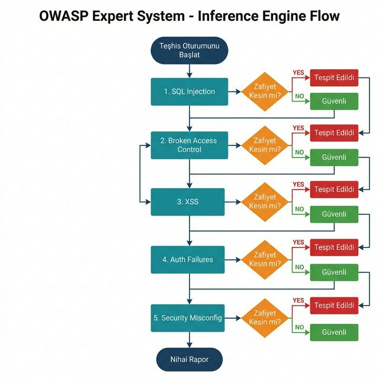
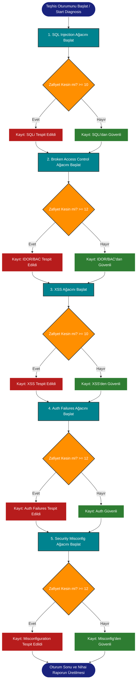

# Uzman Sistem Karar Ağacı (Expert System Decision Tree)

Giriş: Bu uzman sistem (Expert System), **İleri Zincirleme (Forward Chaining)** mantığına dayanmaktadır. Bu belge 5 kategoriye ait alt küme gösterir; runtime sırasında `backend/knowledge-base/rules.json` dosyasında A01–A10 gibi daha fazla kategori tanımlı olabilir ve `backend/src/engine.js` dosyası çalışırken tüm kategoriler üzerinde döner. "Evet" olarak yanıtlanan her gösterge, o kategori için belirli bir ağırlık (Weight) puanı ekler.
Bir kategorinin soruları tamamlandığında, elde edilen toplam puan "Eşik Değeri" (Threshold) ile karşılaştırılır. Eğer toplam puan eşik değerini aşarsa (veya eşitse), zafiyet doğrulanır ve sistem son tespiti yaparak sonraki kategoriye geçer.

Bu belge iki bölüme ayrılmıştır:
1. **Birleşik Yüksek Seviyeli Ağaç:** Sistemin genel çalışma akışının bir alt kümesi olarak dizilen 5 örnek zafiyeti sırasıyla nasıl değerlendirdiğini gösteren ana akış.
2. **Detaylı Karar Ağaçları:** Örnek/alt küme olarak seçilmiş 5 zafiyete ait 7 gösterge (S1-S35), eklenen ağırlık puanları ve eşik değerlendirmesini içeren detaylı şemalar.

---

## 1. 5 Zafiyet İçin Birleşik Ana Şema (High-Level Combined Tree)
Bu şema, çıkarım motorunun (Inference Engine) genel çalışma akışının bir alt kümesini göstermektedir.

Bu şema, çıkarım motorunun (Inference Engine) tüm kategorileri değerlendirmek için izlediği ana yolu (Main Flow) göstermektedir.

---

## 2. Her Zafiyet İçin Detaylı Karar Ağaçları (Detailed Trees)

Aşağıdaki şemalar, her bir zafiyetin kendi içindeki detaylı sorularını göstermektedir. Elmas (Rhombus) şekilleri sistemin kullanıcıya sorduğu soruları, dikdörtgen şekiller ise çalışma belleğine (Working Memory) eklenen ağırlık puanlarını temsil eder.

### A) Karar Ağacı: SQL Enjeksiyonu (SQLi)
**Hedef:** SQLi zafiyetini tespit etmek. **Eşik Değeri (Threshold): 10**

```mermaid
graph TD
    classDef qNode fill:#1565C0,stroke:#fff,stroke-width:2px,color:#fff;
    classDef wNode fill:#43A047,stroke:#fff,stroke-width:2px,color:#fff;
    classDef eval fill:#FF8F00,stroke:#333,stroke-width:2px,color:#fff;
    classDef vuln fill:#B71C1C,stroke:#fff,stroke-width:2px,color:#fff;
    classDef safe fill:#2E7D32,stroke:#fff,stroke-width:2px,color:#fff;

    Start([SQL Injection Değerlendirmesi]) --> Q1{"S1: ' OR 1=1 -- yazılarak tüm kayıtlara erişilebiliyor mu?"}:::qNode
    Q1 -- Evet --> W1[+3 Puan Ekle]:::wNode --> Q2
    Q1 -- Hayır --> Q2{"S2: Hata sayfasında SQL sözdizimi hatası gösteriliyor mu?"}:::qNode
    W1 --> Q2
    
    Q2 -- Evet --> W2[+3 Puan Ekle]:::wNode --> Q3
    Q2 -- Hayır --> Q3{"S3: Sorgular + ile metin birleştirilerek mi oluşturuluyor?"}:::qNode
    W2 --> Q3
    
    Q3 -- Evet --> W3[+3 Puan Ekle]:::wNode --> Q4
    Q3 -- Hayır --> Q4{"S4: Prepared Statement / ORM eksikliği var mı?"}:::qNode
    W3 --> Q4
    
    Q4 -- Evet --> W4[+3 Puan Ekle]:::wNode --> Q5
    Q4 -- Hayır --> Q5{"S5: Sıradan form girdisiyle kayıtlar silinebiliyor mu?"}:::qNode
    W4 --> Q5
    
    Q5 -- Evet --> W5[+4 Puan Ekle]:::wNode --> Q6
    Q5 -- Hayır --> Q6{"S6: UNION SELECT ile şifre hash'leri elde edilebiliyor mu?"}:::qNode
    W5 --> Q6
    
    Q6 -- Evet --> W6[+4 Puan Ekle]:::wNode --> Q7
    Q6 -- Hayır --> Q7{"S7: DB hesabı admin yetkisine sahip mi?"}:::qNode
    W6 --> Q7
    
    Q7 -- Evet --> W7[+3 Puan Ekle]:::wNode --> Eval
    Q7 -- Hayır --> Eval{Değerlendirme: Toplam Puan >= 10 mu?}:::eval
    W7 --> Eval

    Eval -- Evet --> Found[🚨 SQL Injection Tespit Edildi]:::vuln
    Eval -- Hayır --> NotFound[✅ SQLi Kanıtı Yetersiz]:::safe
```

---

### B) Karar Ağacı: Broken Access Control & IDOR
**Hedef:** Erişim kontrolü ihlallerini tespit etmek. **Eşik Değeri (Threshold): 12**

```mermaid
graph TD
    classDef qNode fill:#1565C0,stroke:#fff,stroke-width:2px,color:#fff;
    classDef wNode fill:#43A047,stroke:#fff,stroke-width:2px,color:#fff;
    classDef eval fill:#FF8F00,stroke:#333,stroke-width:2px,color:#fff;
    classDef vuln fill:#B71C1C,stroke:#fff,stroke-width:2px,color:#fff;
    classDef safe fill:#2E7D32,stroke:#fff,stroke-width:2px,color:#fff;

    Start([Access Control Değerlendirmesi]) --> Q8{"S8: id=42, 43 yapıldığında başkasının verisi görünüyor mu?"}:::qNode
    Q8 -- Evet --> W8[+4 Puan Ekle]:::wNode --> Q9
    Q8 -- Hayır --> Q9{"S9: Başkasının dosyası (fatura vb.) URL'den indirilebiliyor mu?"}:::qNode
    W8 --> Q9
    
    Q9 -- Evet --> W9[+4 Puan Ekle]:::wNode --> Q10
    Q9 -- Hayır --> Q10{"S10: Giriş yapmadan /admin sayfasına ulaşılabiliyor mu?"}:::qNode
    W9 --> Q10
    
    Q10 -- Evet --> W10[+4 Puan Ekle]:::wNode --> Q11
    Q10 -- Hayır --> Q11{"S11: Sunucu, sahibini doğrulamadan kayıt güncelliyor mu?"}:::qNode
    W10 --> Q11
    
    Q11 -- Evet --> W11[+3 Puan Ekle]:::wNode --> Q12
    Q11 -- Hayır --> Q12{"S12: Arayüz yetki kontrolü yerine butonları CSS ile mi gizliyor?"}:::qNode
    W11 --> Q12
    
    Q12 -- Evet --> W12[+3 Puan Ekle]:::wNode --> Q13
    Q12 -- Hayır --> Q13{"S13: Fatura numarası URL üzerinden tahmin edilebiliyor mu?"}:::qNode
    W12 --> Q13
    
    Q13 -- Evet --> W13[+3 Puan Ekle]:::wNode --> Q14
    Q13 -- Hayır --> Q14{"S14: /backup/db_export.sql yedeği herkese açık mı?"}:::qNode
    W13 --> Q14
    
    Q14 -- Evet --> W14[+4 Puan Ekle]:::wNode --> Eval
    Q14 -- Hayır --> Eval{Değerlendirme: Toplam Puan >= 12 mi?}:::eval
    W14 --> Eval

    Eval -- Evet --> Found[🚨 Broken Access Control Tespit Edildi]:::vuln
    Eval -- Hayır --> NotFound[✅ IDOR/BAC Kanıtı Yetersiz]:::safe
```

---

### C) Karar Ağacı: Siteler Arası Betik Çalıştırma (XSS)
**Hedef:** XSS zafiyetini tespit etmek. **Eşik Değeri (Threshold): 10**

```mermaid
graph TD
    classDef qNode fill:#1565C0,stroke:#fff,stroke-width:2px,color:#fff;
    classDef wNode fill:#43A047,stroke:#fff,stroke-width:2px,color:#fff;
    classDef eval fill:#FF8F00,stroke:#333,stroke-width:2px,color:#fff;
    classDef vuln fill:#B71C1C,stroke:#fff,stroke-width:2px,color:#fff;
    classDef safe fill:#2E7D32,stroke:#fff,stroke-width:2px,color:#fff;

    Start([XSS Değerlendirmesi]) --> Q15{"S15: Yorum alanındaki <script> çalışıyor mu?"}:::qNode
    Q15 -- Evet --> W15[+4 Puan Ekle]:::wNode --> Q16
    Q15 -- Hayır --> Q16{"S16: Aranan kelime HTML encode edilmeden sayfaya dönüyor mu?"}:::qNode
    W15 --> Q16
    
    Q16 -- Evet --> W16[+3 Puan Ekle]:::wNode --> Q17
    Q16 -- Hayır --> Q17{"S17: XSS ile session cookie çalınabiliyor mu?"}:::qNode
    W16 --> Q17
    
    Q17 -- Evet --> W17[+4 Puan Ekle]:::wNode --> Q18
    Q17 -- Hayır --> Q18{"S18: Sitede CSP (Content-Security-Policy) başlığı yok mu? (Inverse Soru)"}:::qNode
    W17 --> Q18
    
    Q18 -- Hayır --> W18[+2 Puan Ekle]:::wNode --> Q19
    Q18 -- Evet --> Q19{"S19: Profil 'Ad Soyad' alanı HTML kod kabul ediyor mu?"}:::qNode
    W18 --> Q19
    
    Q19 -- Evet --> W19[+3 Puan Ekle]:::wNode --> Q20
    Q19 -- Hayır --> Q20{"S20: Arama sonuçlarında img onerror gibi etiketler gösteriliyor mu?"}:::qNode
    W19 --> Q20
    
    Q20 -- Evet --> W20[+3 Puan Ekle]:::wNode --> Q21
    Q20 -- Hayır --> Q21{"S21: XSS ile phishing sitesine yönlendirme yapılabiliyor mu?"}:::qNode
    W20 --> Q21
    
    Q21 -- Evet --> W21[+4 Puan Ekle]:::wNode --> Eval
    Q21 -- Hayır --> Eval{Değerlendirme: Toplam Puan >= 10 mu?}:::eval
    W21 --> Eval

    Eval -- Evet --> Found[🚨 XSS Tespit Edildi]:::vuln
    Eval -- Hayır --> NotFound[✅ XSS Belirtisi Bulunamadı]:::safe
```

---

### D) Karar Ağacı: Kimlik Doğrulama Hataları (Authentication Failures)
**Hedef:** Giriş ve oturum denetim zafiyetlerini belirlemek. **Eşik Değeri (Threshold): 12**

```mermaid
graph TD
    classDef qNode fill:#1565C0,stroke:#fff,stroke-width:2px,color:#fff;
    classDef wNode fill:#43A047,stroke:#fff,stroke-width:2px,color:#fff;
    classDef eval fill:#FF8F00,stroke:#333,stroke-width:2px,color:#fff;
    classDef vuln fill:#B71C1C,stroke:#fff,stroke-width:2px,color:#fff;
    classDef safe fill:#2E7D32,stroke:#fff,stroke-width:2px,color:#fff;

    Start([Kimlik Doğrulama Değerlendirmesi]) --> Q22{"S22: Kısıtlama olmadan Brute-Force yapılabiliyor mu?"}:::qNode
    Q22 -- Evet --> W22[+3 Puan Ekle]:::wNode --> Q23
    Q22 -- Hayır --> Q23{"S23: Sistem 123456 gibi zayıf şifreleri kabul ediyor mu?"}:::qNode
    W22 --> Q23
    
    Q23 -- Evet --> W23[+3 Puan Ekle]:::wNode --> Q24
    Q23 -- Hayır --> Q24{"S24: Çok faktörlü doğrulama (MFA) tamamen eksik mi?"}:::qNode
    W23 --> Q24
    
    Q24 -- Evet --> W24[+2 Puan Ekle]:::wNode --> Q25
    Q24 -- Hayır --> Q25{"S25: Şifre sıfırlama linki 7 gün geçerliliğini koruyor mu?"}:::qNode
    W24 --> Q25
    
    Q25 -- Evet --> W25[+3 Puan Ekle]:::wNode --> Q26
    Q25 -- Hayır --> Q26{"S26: Giriş yaptıktan sonra Session ID aynı kalıyor mu? (Fixation)"}:::qNode
    W25 --> Q26
    
    Q26 -- Evet --> W26[+4 Puan Ekle]:::wNode --> Q27
    Q26 -- Hayır --> Q27{"S27: Session ID URL parametresi üzerinden enjekte edilebiliyor mu?"}:::qNode
    W26 --> Q27
    
    Q27 -- Evet --> W27[+3 Puan Ekle]:::wNode --> Q28
    Q27 -- Hayır --> Q28{"S28: Hesap kurtarmada kolay tahmin edilir sorular mı kullanılıyor?"}:::qNode
    W27 --> Q28
    
    Q28 -- Evet --> W28[+3 Puan Ekle]:::wNode --> Eval
    Q28 -- Hayır --> Eval{Değerlendirme: Toplam Puan >= 12 mi?}:::eval
    W28 --> Eval

    Eval -- Evet --> Found[🚨 Auth Failures Tespit Edildi]:::vuln
    Eval -- Hayır --> NotFound[✅ Oturum Mekanizması Güvenli Gözüküyor]:::safe
```

---

### E) Karar Ağacı: Güvenlik Yapılandırma Hataları (Misconfiguration)
**Hedef:** Yanlış yapılandırılmış sunucu ayarlarını bulmak. **Eşik Değeri (Threshold): 12**

```mermaid
graph TD
    classDef qNode fill:#1565C0,stroke:#fff,stroke-width:2px,color:#fff;
    classDef wNode fill:#43A047,stroke:#fff,stroke-width:2px,color:#fff;
    classDef eval fill:#FF8F00,stroke:#333,stroke-width:2px,color:#fff;
    classDef vuln fill:#B71C1C,stroke:#fff,stroke-width:2px,color:#fff;
    classDef safe fill:#2E7D32,stroke:#fff,stroke-width:2px,color:#fff;

    Start([Security Misconfig Değerlendirmesi]) --> Q29{"S29: Hata sayfalarında Stack Trace görülüyor mu?"}:::qNode
    Q29 -- Evet --> W29[+3 Puan Ekle]:::wNode --> Q30
    Q29 -- Hayır --> Q30{"S30: Üretim (Production) ortamında Debug modu etkin mi?"}:::qNode
    W29 --> Q30
    
    Q30 -- Evet --> W30[+3 Puan Ekle]:::wNode --> Q31
    Q30 -- Hayır --> Q31{"S31: Varsayılan kullanıcı adı ve şifre (admin/admin) duruyor mu?"}:::qNode
    W30 --> Q31
    
    Q31 -- Evet --> W31[+4 Puan Ekle]:::wNode --> Q32
    Q31 -- Hayır --> Q32{"S32: DB portları (3306 vs.) internete açık mı?"}:::qNode
    W31 --> Q32
    
    Q32 -- Evet --> W32[+4 Puan Ekle]:::wNode --> Q33
    Q32 -- Hayır --> Q33{"S33: Dizin listeleme (Directory Listing) aktif mi?"}:::qNode
    W32 --> Q33
    
    Q33 -- Evet --> W33[+3 Puan Ekle]:::wNode --> Q34
    Q33 -- Hayır --> Q34{"S34: .env dosyasına tarayıcıdan erişilebiliyor mu?"}:::qNode
    W33 --> Q34
    
    Q34 -- Evet --> W34[+4 Puan Ekle]:::wNode --> Q35
    Q34 -- Hayır --> Q35{"S35: Kullanılan kütüphanelerde bilinen açıklar var mı?"}:::qNode
    W34 --> Q35
    
    Q35 -- Evet --> W35[+3 Puan Ekle]:::wNode --> Eval
    Q35 -- Hayır --> Eval{Değerlendirme: Toplam Puan >= 12 mi?}:::eval
    W35 --> Eval

    Eval -- Evet --> Found[🚨 Misconfiguration Tespit Edildi]:::vuln
    Eval -- Hayır --> NotFound[✅ Sunucu Yapılandırması Güvenli]:::safe
```

---

**Özet:**
Uzman sistem (Expert System) `engine.js` modülü aracılığıyla yukarıdaki kural dizilerini işletir. Sistemin esnekliği sayesinde tek bir cevabın "Evet" veya "Hayır" olması mutlak kararı belirlemez; ağırlık puanları (Weights) eşik sınırını (Threshold) aşana kadar risk ihtimali artar. Bu tasarım, "Gürültüyü (False Positives)" azaltır ve uzman kalitesinde teşhis sağlar.
